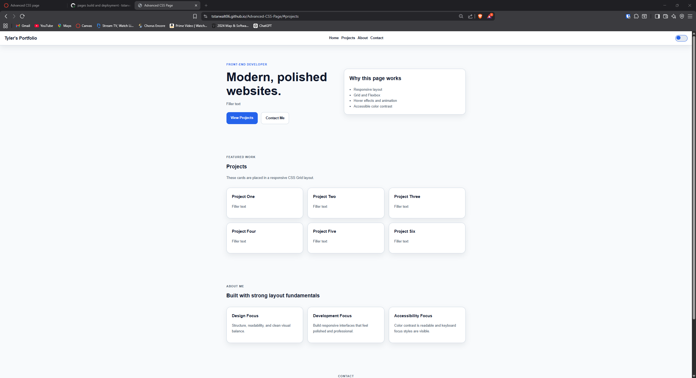
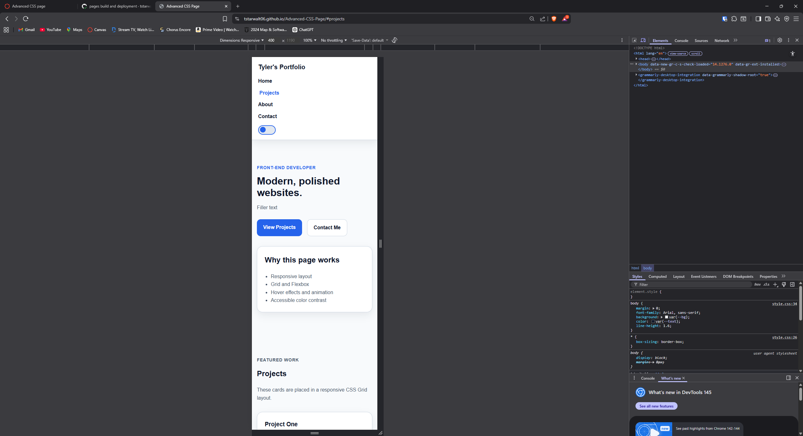

# Advanced-CSS-Page

A polished, responsive landing page built with HTML, CSS Grid, Flexbox, and JavaScript.  

---

## Live Site

GitHub Pages Link:  
[Page](https://tstarwalt06.github.io/Advanced-CSS-Page/#projects)

Repository Link:  
[Repo](https://github.com/tstarwalt06/Advanced-CSS-Page)

---

## Description

This project demonstrates a professional landing page layout using a mobile-first design approach. The page adapts to different screen sizes, includes interactive UI elements, and supports both light and dark themes.

The layout uses **CSS Grid** for the project gallery and **Flexbox** for navigation and layout components. Hover transitions and animations improve the user experience, while accessibility considerations ensure readable contrast and keyboard navigation.

---

## Features Checklist

### Layout
- CSS Grid used for the projects section
- Flexbox used for the navigation bar and layout components
- Mobile-first responsive design

### Responsive Design
- Two breakpoints for tablet and desktop layouts
- Responsive navigation menu for mobile and desktop

### Animations
- Button hover transition
- Card hover transition
- Fade-in animation for hero section

### Dark Mode
- CSS variables used for theme colors
- Toggle button switches between light and dark mode
- Theme preference stored using `localStorage`

### Accessibility
- One `<h1>` element for proper document structure
- Visible keyboard focus styles
- Readable color contrast for both themes

---

## Technologies Used

- HTML5
- CSS3
- CSS Grid
- Flexbox
- JavaScript
- LocalStorage

---

## Screenshots

